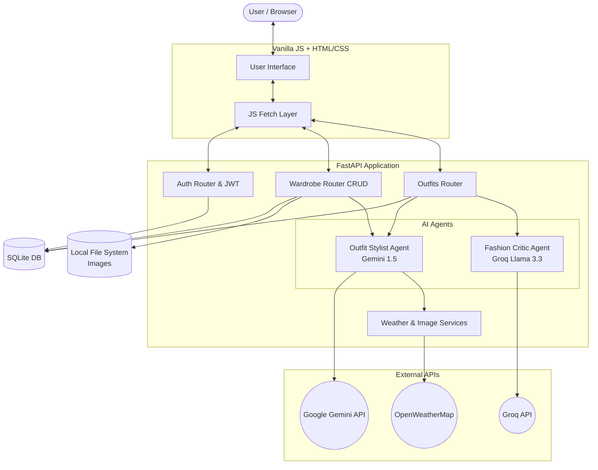
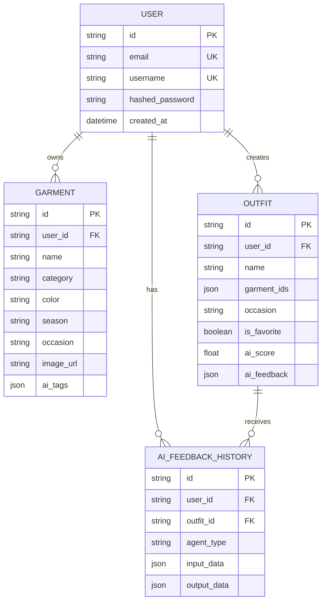
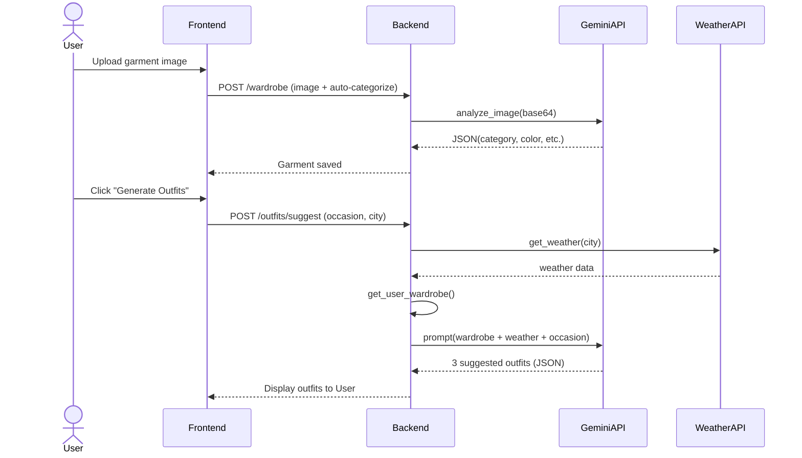
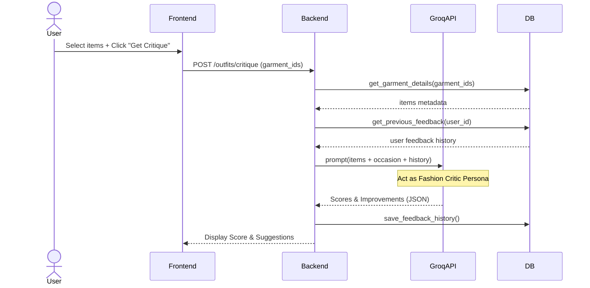

# Arhitectură și Diagrame

Mai jos sunt diagramele care descriu arhitectura aplicației **OutfitCheck AI**, fluxurile de lucru (workflows) și modelele de date, realizate cu Mermaid.

## 1. Arhitectura Componentelor (C4 Model - Container Level)

## 2. Diagrama UML a Bazei de Date (Entități și Relații)

## 3. Workflow: Agent 1 - Outfit Stylist (Upload & Generate)

## 4. Workflow: Agent 2 - Fashion Critic

